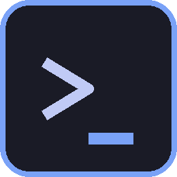

<div align="center">
  

  # Multi-Terminal

  Terminal app with tabs, tmux-style splits, themes, and a command palette.
  Built with Tauri 2, React, TypeScript, and Rust.

  
  
  
  
  
</div>

---

## Contents

- [Download](#download)
- [Features](#features)
- [Keybindings](#keybindings)
- [Themes](#themes)
- [Build from source](#build-from-source)
- [Project structure](#project-structure)
- [Configuration](#configuration)
- [Troubleshooting](#troubleshooting)
- [License](#license)

## Download

Pre-built Windows installer:

➡️ [**Latest release on GitHub**](https://github.com/eneskrdm/Multi-Terminal/releases/latest)

Grab the `.exe` installer, run it, done. macOS and Linux: build from source (see below).

## Features

- **Tabs** — multiple terminals side-by-side in tabs with drag-to-reorder, rename, middle-click close.
- **Splits** — tmux-style horizontal and vertical splits with draggable dividers and geometric focus navigation (Alt + arrows).
- **New-tab dialog** — the `+` button opens a picker where you choose profile, starting directory (with live subdirectory autocomplete), and an initial pane layout (1, 2 columns, 2 rows, 3 columns, main + stack, 2×2 grid).
- **Profiles** — PowerShell, cmd, WSL, bash, zsh, fish, nu, git bash, … auto-detected on first run. Add custom shell profiles with per-profile `args`, `env`, `cwd`, icon, and color.
- **Themes** — 10 built-in color schemes (Tokyo Night, Dracula, Nord, Catppuccin Mocha, One Dark, Gruvbox Dark, Solarized Dark, Monokai Pro, Ayu Dark, GitHub Light) plus a live theme editor for custom schemes.
- **Command palette** — `Ctrl+Shift+P` with fuzzy search over every command.
- **Customizable keybindings** — every command has a configurable accelerator in Settings → Keybindings, including chord shortcuts.
- **GPU-accelerated rendering** — xterm.js with the WebGL renderer, ligatures, Unicode 11 width, link-under-cursor.
- **Custom title bar** — native-feeling window controls (no OS chrome), draggable anywhere in the titlebar.
- **Search in terminal** — `Ctrl+Shift+F` opens an in-buffer search with highlights.

## Keybindings

Defaults shown below. Every binding is editable under **Settings → Keybindings**.

### Tabs

| Action | Shortcut |
|---|---|
| New tab (default profile) | `Ctrl+T` |
| New tab (dialog with profile + layout + cwd) | click `+` in tab bar |
| Close tab | `Ctrl+W` |
| Next / previous tab | `Ctrl+Tab` / `Ctrl+Shift+Tab` |
| Jump to tab 1–9 | `Ctrl+1` … `Ctrl+9` |

### Panes (splits)

| Action | Shortcut |
|---|---|
| Split horizontally | `Ctrl+Shift+E` |
| Split vertically | `Ctrl+Shift+O` |
| Close pane | `Ctrl+Shift+W` |
| Focus pane left / right / up / down | `Alt+←` / `Alt+→` / `Alt+↑` / `Alt+↓` |
| Zoom active pane | `Ctrl+Shift+Z` |

### Terminal

| Action | Shortcut |
|---|---|
| Copy | `Ctrl+Shift+C` |
| Paste | `Ctrl+Shift+V` |
| Clear | `Ctrl+L` |
| Find in buffer | `Ctrl+Shift+F` |
| Zoom in / out / reset | `Ctrl+=` / `Ctrl+-` / `Ctrl+0` |

### Application

| Action | Shortcut |
|---|---|
| Command palette | `Ctrl+Shift+P` |
| Open settings | `Ctrl+,` |
| Switch theme | `Ctrl+K Ctrl+T` |

## Themes

Built-in themes ship with accurate upstream palettes:

Tokyo Night · Dracula · Nord · Catppuccin Mocha · One Dark · Gruvbox Dark · Solarized Dark · Monokai Pro · Ayu Dark · GitHub Light.

Open the **Theme Editor** (`Ctrl+K Ctrl+T`, or Settings → Appearance → Customize theme…) to tweak every terminal / UI color with a live preview. Custom themes are stored locally under the `multiterminal:custom-themes` localStorage key.

## Build from source

### Prerequisites

All platforms:
- [Node.js 18+](https://nodejs.org/)
- [Rust stable](https://www.rust-lang.org/tools/install) (`rustup` is recommended)

Platform-specific system dependencies (from [tauri.app/start/prerequisites](https://tauri.app/start/prerequisites/)):
- **Windows** — Microsoft Edge WebView2 (pre-installed on Windows 10+; otherwise the [Evergreen Bootstrapper](https://developer.microsoft.com/microsoft-edge/webview2/)) and [Visual Studio C++ Build Tools](https://visualstudio.microsoft.com/visual-cpp-build-tools/).
- **macOS** — Xcode Command Line Tools: `xcode-select --install`.
- **Linux** — `webkit2gtk-4.1`, `libayatana-appindicator3`, `librsvg2`, `openssl`, `build-essential` (check your distro's Tauri prerequisites page).

### Clone and run

```bash
git clone https://github.com/eneskrdm/Multi-Terminal.git
cd Multi-Terminal
npm install
npm run tauri:dev
```

`tauri:dev` starts the Vite dev server and launches the Rust backend against it with hot reload on the frontend.

### Type-check only

```bash
npm run typecheck
```

### Production build

```bash
npm run tauri:build
```

Output:
- Windows: `src-tauri/target/release/bundle/nsis/*.exe` (installer), plus `Multi-Terminal.exe` portable binary.
- macOS: `.dmg` under `bundle/dmg`.
- Linux: `.deb` / `.rpm` / `.AppImage` under `bundle/`.

### Regenerate icons

Icons are checked in, but can be regenerated with the Python helper:

```bash
cd src-tauri/icons
python gen.py
```

Requires `Pillow`: `pip install Pillow`.

## Project structure

```
Multi-Terminal/
├── src/                           React + TypeScript frontend
│   ├── components/
│   │   ├── AppShell/               top-level layout
│   │   ├── TitleBar/               custom window chrome
│   │   ├── TabBar/                 tabs + drag-reorder + + button
│   │   ├── NewTabDialog/           profile + layout + cwd picker
│   │   ├── Terminal/               xterm.js wrapper
│   │   ├── SplitPane/              recursive split tree + draggable dividers
│   │   ├── CommandPalette/         cmdk-based palette
│   │   ├── Settings/               settings modal (5 sections)
│   │   ├── ThemeEditor/            theme editor + live preview
│   │   ├── StatusBar/              bottom status bar
│   │   ├── ContextMenu/            right-click menu
│   │   └── common/                 Button, Input, Dialog, Switch, Kbd, …
│   ├── store/                      Zustand stores (tabs, layout, terminals, settings, themes)
│   ├── themes/                     10 built-in theme palettes
│   ├── lib/
│   │   ├── tauri.ts                 typed IPC wrapper
│   │   ├── commands.ts              command registry + dispatcher + UI store
│   │   └── events.ts                tiny typed event bus
│   ├── hooks/
│   │   ├── useHotkeys.ts            global keybinding listener
│   │   └── useContextMenu.ts
│   ├── styles/                     reset / variables / scrollbar / animations / globals
│   └── types/index.ts              shared types (the contract)
├── src-tauri/                     Rust backend
│   ├── src/
│   │   ├── lib.rs                  Tauri bootstrap, plugin + command registration
│   │   ├── pty/manager.rs          portable-pty lifecycle + reader threads + title parsing
│   │   ├── commands/
│   │   │   ├── terminal.rs         create / write / resize / kill / list
│   │   │   ├── settings.rs         settings_load / settings_save
│   │   │   ├── shell.rs            shell autodetect
│   │   │   ├── window.rs           window controls (min/max/close)
│   │   │   └── fs.rs               home / expand / list-subdirs / path-is-dir
│   │   ├── config/                 Settings / Profile + default keybindings
│   │   ├── state.rs                shared AppState
│   │   └── error.rs                AppError + Result alias
│   ├── Cargo.toml
│   ├── tauri.conf.json
│   └── icons/                      app icons (ico / icns / png)
├── CONTRACT.md                    inter-module contract (types, commands, stores)
├── LICENSE                        MIT
└── package.json
```

## Configuration

Settings are persisted to the OS data directory:

- **Windows** — `%APPDATA%\MultiTerminal\settings.json`
- **macOS** — `~/Library/Application Support/MultiTerminal/settings.json`
- **Linux** — `~/.local/share/MultiTerminal/settings.json`

Theme overrides and recent directories use browser localStorage inside the WebView.

All settings can be changed through the Settings UI (`Ctrl+,`). The JSON file is also hand-editable when the app is closed.

## Troubleshooting

- **No shell profile after first launch.** The backend picks `pwsh.exe` → `powershell.exe` → `cmd.exe` on Windows, `$SHELL` → `/bin/bash` → `/bin/sh` elsewhere. If none are on `PATH`, open **Settings → Profiles → Add profile** and point it at a shell binary manually.
- **Font looks wrong.** The default is `Cascadia Code`. Install it from [microsoft/cascadia-code](https://github.com/microsoft/cascadia-code) or change the family under **Settings → Appearance**.
- **WebGL renderer fails.** The terminal falls back to the canvas renderer automatically. Toggle it off under **Settings → Advanced → WebGL rendering**.
- **Windows installer warning.** The installer isn't code-signed. Click "More info" → "Run anyway" in SmartScreen; the signing certificate is an upcoming addition.

## License

[MIT](LICENSE) © 2026 **Enes Karademir**

---

<sub>Made by [Enes Karademir](https://github.com/eneskrdm).</sub>
